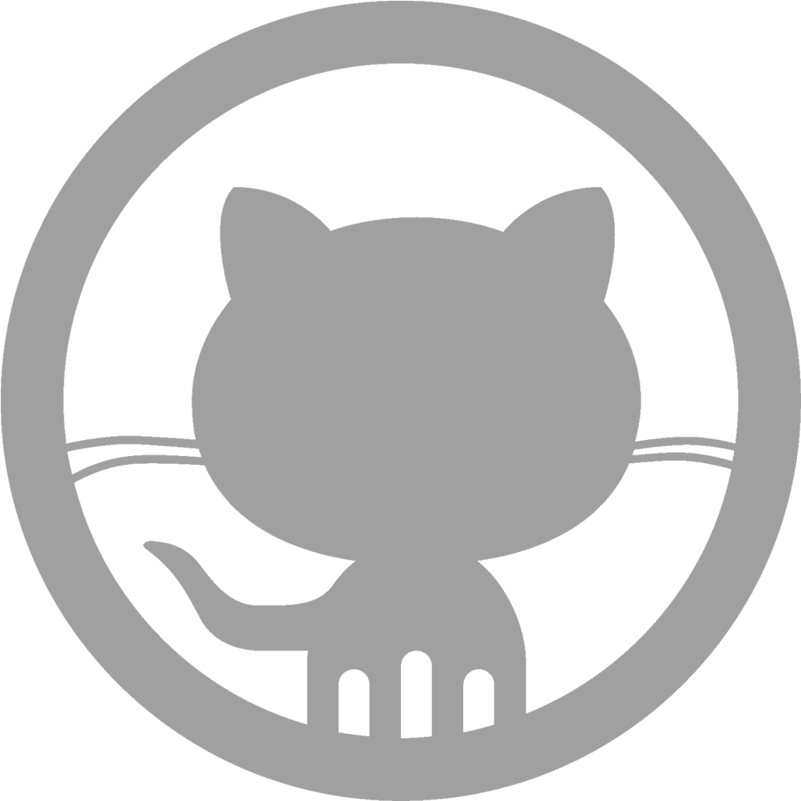

# Hi there! I'm Laura 
I’m a web app development student at IES Gran Capitán.

## About Me

Web development and web design are part of my everyday life since 2020. I'm currently a web development graduate and I love to keep learning new things constantly!  

Entering the world of technology development is probably the best decision I've taken. The immense amount of room to learn is astonishing and challenging, and that's what makes me want to keep doing this for a very long time!  

## Languages and Tools 

## Connect with me 

 

## My GitHub Stats 

